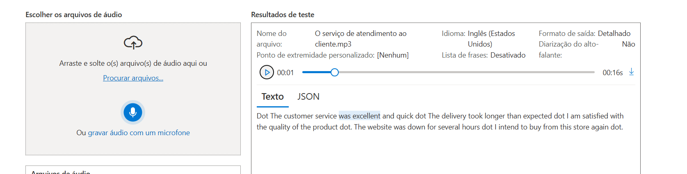
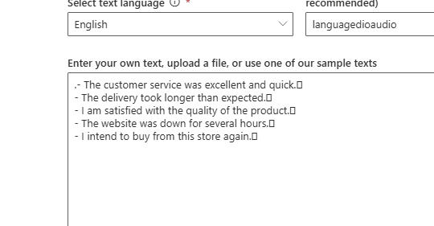
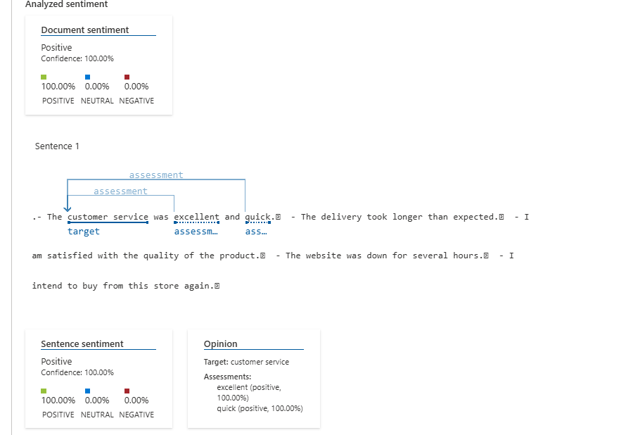
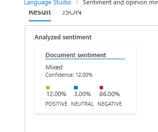
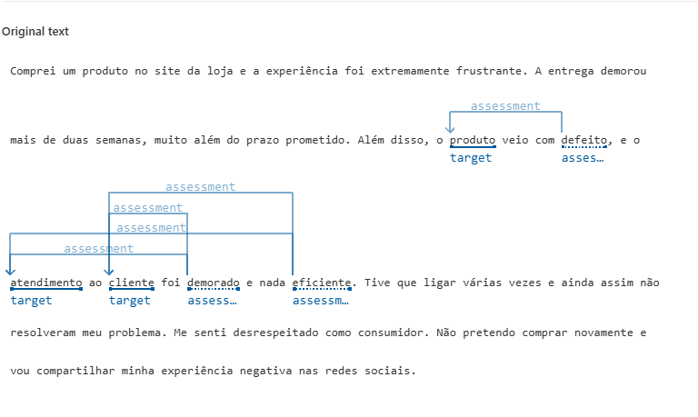

# Analise-Sentencas-Azure-AI

## 💬 Objetivo

Este projeto utiliza os serviços de IA do Azure para analisar um conjunto de sentenças em linguagem natural.

## 🧠 Serviços utilizados

- Linguagem de IA do Azure
  - Extração de frases-chave
  - Análise de sentimentos

## 🛠️ Etapas do processo

1. Criação de um arquivo com frases reais simulando avaliações de clientes.
2. Análise das frases com os serviços de IA do Azure via Language Studio.
3. Interpretação dos resultados: sentimentos e termos mais relevantes.

---

## Textos
### A

sentecas.txt

---

---

### B
reclamar.txt

---

---

